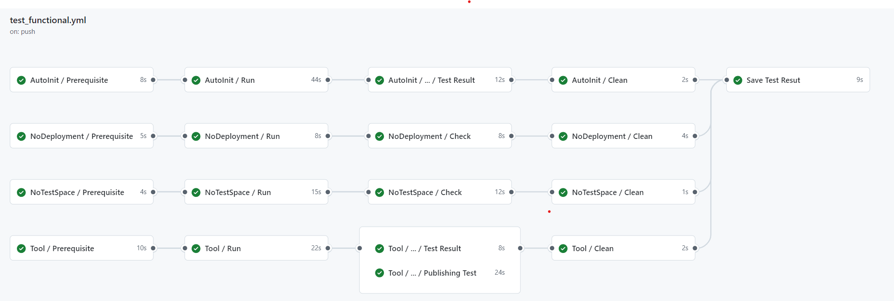
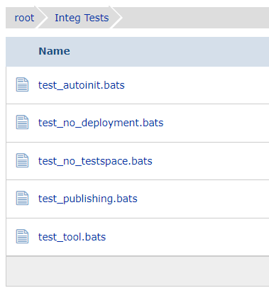
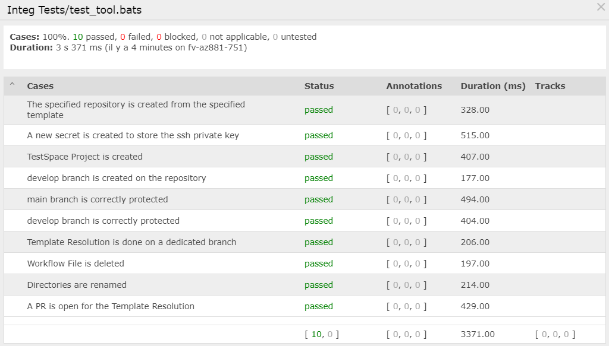

# init-repo-action

Action to Init Repositories
[](https://github.com/marketplace/actions/super-linter)
[](https://github.com/fletort/init-repo-action/actions/workflows/test.yml)
[](https://fletort.testspace.com/projects/68222/spaces)

This action was created to can have an unique code/procedure to create my
repositories from "dynamic template" whatever the context.
It can be adapted to a lot of behavior.

It can be used in two main ways:

- From _a repository tool_ as my [dynamic-template-tool action](https://github.com/fletort/dynamic-template-tool),
- or as a Auto Dynamic Template: directly from the template creation procedure as in
  my [template-common-js](https://github.com/fletort/template-common-js). This
  last case is **only possible** when the new repositories is created **inside an**
  **organization**, where needed secrets can be available globally.

## Behaviour

- Create the new repository defined by `repository` from the specified `template` (if asked)
- Checkout the new repository defined by `repository`
- Manage SSH cnx to the repository specified by `repository_deployment` with the help of the
  [generate-ssh-deploy-repo-action](https://github.com/fletort/generate-ssh-deploy-repo-action) action, if `repository_deployment` is defined.
- Create the linked TestSpace Project with the help of the
  [fletort/testspace-create-action](https://github.com/fletort/testspace-create-action) action in the specified `testspace_domain`
  if asked with `testspace_link_enable` parameter.
- Manage Dynamic Template Substitution with the help of the
  [fletort/jinja2-template-action] action.
- Remove AutoInit Workflow (this feature can be disabled with the `delete-workflow` option):
  - on a Dynamic Template (repository that init itself), the current workflow file (calling the current action) is deleted
  - on a tool behaviour (repository targeted is not the repository calling the action), workflow contening a call to the current action are deleted
    (such workflow exist if the repository is created from a Template with Dynamic Feature)
- Rename all directorie from the template that beging with the `$` character.
  For example the `$.github` directory will be renamed to `.github`.
  If the final directory exists, it is replaced with the content of the renamed directory.
- Create a Commit and optionaly related Pull Request for this Template resolution code modification
  with the help of [peter-evans/create-pull-request](https://github.com/peter-evans/create-pull-request) action.
- Define new branch and related branch protection with the help of the [fletort/branch-protection-action]. If a simple commit is made, this step is done before the commit, if a PR is used this step is made before the Commit/PR.

We recommend using a service account with the least permissions necessary. Also
when generating a new PAT, select the least scopes necessary.
[Learn more about creating and using encrypted secrets](https://help.github.com/en/actions/automating-your-workflow-with-github-actions/creating-and-using-encrypted-secrets)

## Usage

### Used as a tool

```yaml
- uses: fletort/init-repo-action@v1
  with:
    repository: owner/my_repo_to_create
    template: owner/my_template_repo
    repository_deployment: owner/repo_on_which_we_can_deploy
    token: ${{ secrets.PAT }}
    testspace_link_enable: true
    testspace_token: ${{ secrets.TESTSPACE_TOKEN }}
    testspace_domain: testspace_domain
```

You can also pin to a [specific release](https://github.com/fletort/init-repo-action/releases) version in the format `@v1.x.x`

### Used from a repository that init itself

```yaml
- uses: fletort/init-repo-action@v1
  with:
    repository_deployment: owner/repo_on_which_we_can_deploy
    token: ${{ secrets.PAT }}
    testspace_link_enable: true
    testspace_token: ${{ secrets.TESTSPACE_TOKEN }}
```

You can also pin to a [specific release](https://github.com/fletort/init-repo-action/releases) version in the format `@v1.x.x`

To have a _dynamic template feature_ you can call this action on the `create` event:

```yaml
name: Init Repository and Resolve Dynamic Template
on:
  - create

jobs:
  init_repo:
    name: Init Repository
    runs-on: ubuntu-latest
    permissions:
      contents: write
      pull-requests: write
    steps:
      - name: Checkout
        id: checkout
        uses: fletort/init-repo-action@v1
        with:
          repository_deployment: owner/repo_on_which_we_can_deploy
          token: ${{ secrets.PAT }}
          testspace_link_enable: true
          testspace_token: ${{ secrets.TESTSPACE_TOKEN }}
```

See my template-common-js [template init workflow](https://github.com/fletort/template-common-js/blob/main/.github/workflows/init_repo.yml) for an up to date Dynamic Template worflow.

### Actions inputs

Only inputs specified in the "init itself" usage upper are mandatories.
All other inputs are **optional**.

<!-- prettier-ignore-start -->
| Name | Description | Default |
| --- | --- | --- |
| `repository` | Repository to create and/or init. Indicate the repository name with owner. | `${{ github.repository }}` |
| `template` | Template Repository to use to create the repository. Indicate the repository name with owner. If not used (repository is already created) indicates `no_init` | `no_init` |
| `repository_deployment` | Repository on which `repository` will be able to deploy to through SSH credentials. Indicate the repository name with owner. If not defined (default value), the deployement feature is not initialized. | |
| `token` | The token that action (and used actions) will use. See token. | **MANDATORY** |
| `testspace_link_enable` | Enable or Disable the TestPace project creation Feature. Put `true` to enable. | `false`                                                                             |
| `testspace_token` | Personal testspace token used to interact with the testspace API to create the project  | **MANDATORY if testspace feature is enabled with `testspace_link_enable`**          |
| `testspace_domain`| Testspace SubDomain where the testspace project will be created                | `${{ github.repository_owner }}`                                                    |
| `delete_workflow` | Indicates if the workflow contening the call to this action must be deleted    | `true`                                                                              |
| `j2_keep_template` | Put to `true` to keep original template file. See keep_template input of [fletort/jinja2-template-action]. | `false` |
| `j2_data_file` | Source file contening inputs variable for the jinja template. See data_file input of [fletort/jinja2-template-action]. This file can be on the repository executing the action or from the targeted repository, [see help below](#j2-data-file). | `''` |
| `j2_data_format` | Format of the `data_file`. Can be `env`, `ini`, `yaml`, `json` or `automatic` (for automatic detection). The automatic detction is based on the file extension then on the file content. See data_format input of [fletort/jinja2-template-action]. | `automatic` |
| `j2_data_url` | URL Link contening inputs variable for the jinja template. See data_url input of [fletort/jinja2-template-action]. | "" |
| `j2_data_url_format` | Format of the `data_url`. Can be `env`, `ini`, `yaml`, `json` or `automatic` (for automatic detection). The automatic detection is based on the http header content-type then on the content itself. See data_url_format input of [fletort/jinja2-template-action]. | `automatic` |
| `branches` | List of branches to create with protection definition. See branches input of [fletort/branch-protection-action]. | If not defined use the local file [branch_protection.yam](./branch_protection.yaml) |
| `commit-message` | The message to use when committing changes | '[init-repo-action] Dynamic Template Resolution' |
| `branch-no-pr` | Branch where commit will be done if a pr is not created (on default branch if not defined) | |
| `pr-created` | Indicates if a pr is created | `true` |
| `pr-branch` | Branch where commit will be done if a pr is created. | `template_resolution` |
| `pr-base-branch` | Sets the pull request base branch  (on default branch if not defined) | |
| `pr-title` | The title of the pull request | `Dynamic Template Resolution` |
| `pr-body` | The body of the pull request | `Jinja2 Template Resolution made by jinja2-template-action` |
<!-- prettier-ignore-end -->

#### Commit changes with or without PR

It is possible to commit change (template resolution) directly on a branch with or without an associated PR.
In all the case, the commit message is always defined with `commit-message`.

- If a PR is not needed (`pr-created` is `false`), the existing branch where the commit is done is defined by `branch-no-pr`.
- If a PR is needed, the branch where the commit is doned is defined by `pr-branch`. This branch can be created for this purpose.
  Other attributes of the PR can be defined: `pr-base-branch` defines the PR base branch. If `pr-branch` is created, it is
  created from this `pr-base-branch`. Then the PR title is defined with `pr-title` and the body of its description is
  defined with `pr-body`. All the PR related procedure is managed with the [peter-evans/create-pull-request](https://github.com/peter-evans/create-pull-request)
  action.

#### token

The token must have the following permissions:

- 'Repository Administration':

  - To can create the `repository` (if requested i.e. if a template is defined)
  - To be able to add a publish key to the `repository_deployment`

- 'Repository Contents': To be able to Fetch the `repository` and commit to the `repository`
- 'Repository Secrets': Store secret inside the `repository`
- 'Repository Pull Requests': To be able to create the PR on the `repository` with the template resolution
- 'Repository Worflows': Needed, if you are using directory renaming feature to create the `.github` directory (from a template `$.github` directory)

#### j2 data file

The data file can be on the repository executing the action :

```yaml
- uses: fletort/init-repo-action@v1
  with:
    repository_deployment: owner/repo_on_which_we_can_deploy
    token: ${{ secrets.PAT }}
    testspace_link_enable: true
    testspace_token: ${{ secrets.TESTSPACE_TOKEN }}
    j2_data_file: ./local_dir/data.json
```

Or on the targeted repository by the action, in this case the path must be
added to access the targeted repository. This path is the full repository name,
as shown below :

```yaml
- uses: fletort/init-repo-action@v1
  with:
    repository_deployment: owner/repo_on_which_we_can_deploy
    token: ${{ secrets.PAT }}
    testspace_link_enable: true
    testspace_token: ${{ secrets.TESTSPACE_TOKEN }}
    j2_data_file: owner/repo_on_which_we_can_deploy/data.json
```

In fact, the action checkout the targeted repository by `repository_deployment`
in the path defined by the value of the same input `repository_deployment`.

## Template Specific Content

As this action used the [fletort/jinja2-template-action], your template
can include jinja2 syntax. [See official Jinja2 Template Designer Documentation](https://jinja.palletsprojects.com/en/3.0.x/templates/#).

Specific Variable are injected by this action, and can be used in your template :

| Name                 | Description                                                                                                                                                                                                                                                             |
| -------------------- | ----------------------------------------------------------------------------------------------------------------------------------------------------------------------------------------------------------------------------------------------------------------------- |
| REPOSITORY_PATH      | Repository that is initalized (with the owner). It is the value of the `repository` input.                                                                                                                                                                              |
| TESTSPACE_SPACE_ID   | ID of the created Testspace Space. This is the output of the [fletort/testspace-create-action](https://github.com/fletort/testspace-create-action). If not testspace space is initialized (`testspace_link_enable` to false), the value of TESTSPACE_SPACE_ID is empty. |
| DEPLOYMENT_REPO_PATH | Repository on which deployment is possible (with the owner). It is the value of the `repository_deployment` input. If no deployment feature is not initialized, the value of DEPLOYMENT_REPO_PATH is empty.                                                             |

## Code Quality

All unit/functional test executed on each branch/PR are listed/described on
[this testspace space](https://fletort.testspace.com/projects/68169/spaces).

2 functionals (integration) testsuites are executed on GitHub pipelines


and tests results are send to TestSpace:



For exemple the "tool" test suite contains the following tests:



- The **Tool scenario** tests the role in ["a tool way"](#used-as-a-tool), i.e. targeting a remote repository that is created by the role itself.
  In this case, we are also testing:
  - that we are able to define variable from data file on the jinja2 sub-action (test the link between this actions inputs and the sub-action)
  - that we are able to define variable from URL file on the jinja2 sub-action (test the link between this actions inputs and the sub-action)
  - that we are able to define a custom branch protection (test the link between this actions inputs and the sub-action)
- The **AutoInit scenario** tests the role in ["Dynamic Template way"](#used-from-a-repository-that-init-itself), i.e. a repository that is using the role on itself.
  In this case, we are also testing:
  - that we are able to ask to jinja2 sub-action to keep original template file. (test the link between this actions inputs and the sub-action)
  - that we are able to commit directly to default branch (main) without PR
- The **publishing feature** is tested only in one of the scenario, and appears as a third _test suite_ on TestSpace side.
- The **No Testspace scenario** tests the role when TestSpace creation feature is disabled
- The **No Deployment scenario** tests the role when Deployment feature is disabled

## License

The scripts and documentation in this project are released under the
[MIT License](LICENSE)

[fletort/jinja2-template-action]: https://github.com/fletort/jinja2-template-action
[fletort/branch-protection-action]: https://github.com/fletort/branch-protection-action
